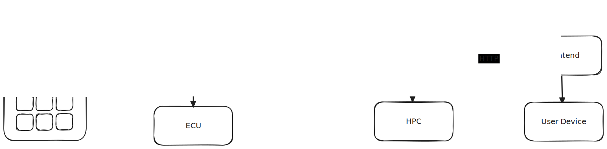

# SofDCar TOSCA4Cars Demonstration

This repository contains the TOSCA4Cars demonstration for the SofDCar closing event.

## Overview



We use [OpenTOSCA Vintner (4cca487655097f296d19e37bd51aa64552dcc9dflol)](https://github.com/opentosca/opentosca-vintner/tree/61deb4a039723042fefd829d19c485746fc8e28e) to manage the variability when deploying the Multi Cushion Massage Seat (MCMS) scenario.
The scenario consists of the following components:

- MCMS Frontend: always in Docker on user device
- MCMS Abstraction: physical on HPC or virtual in Docker on user device
- MCMS Flexible: physical on ECU or virtual mocked in Docker on user device

Besides, we use [OpenTOSCA can2x (e719579d72e02161086ad637fd5bd5e92d80585e)](https://github.com/milesstoetzner/stoetzms-can2x/tree/e719579d72e02161086ad637fd5bd5e92d80585e) to send CAN messages via the network.


## Hardware

We use the following hardware.


### Developer Machine

We use Ubuntu 22.04 as operating system running on a x64 machine.
We refer to this machine also as _developer laptop_, _user device_, _orchestrator_, and _orchestrator host_.


### HPC

We use Raspberry Pi 4 Model B as HPC.


### ECU

We use Arduino Mega 2560 R3 as ECU.
To be specific, during development, we use [Elegoo Mega 2560 R3](https://www.elegoo.com/products/elegoo-mega-2560-r3-board).


## Setup

We have the following tooling setup.


### OpenTOSCA Vintner

We use [OpenTOSCA Vintner (4cca487655097f296d19e37bd51aa64552dcc9dflol)](https://github.com/opentosca/opentosca-vintner/tree/61deb4a039723042fefd829d19c485746fc8e28e) as TOSCA preprocessing and management layer to manage deployment variability and to deploy applications.
Please install it by extracting the respective archive and add the contained binary to your `PATH`.

- [Linux arm64](assets/vintner-alpine-x64.xz)
- [Linux arm64](assets/vintner-linux-arm64.xz)
- [Linux x64](assets/vintner-linux-x64.xz)
- [Windows x64](assets/vintner-win-x64.exe.xz)


### Unfurl

We use [Unfurl (v1.0.0)](https://github.com/onecommons/unfurl) as underlying TOSCA orchestrator.
Please install it as follows.

````shell
vintner install unfurl
````

### Ansible

We use [Ansible](https://www.ansible.com) as underlying deployment technology for TOSCA implementation artifacts.
Ansible is automatically installed when installing Unfurl as proposed.


### PlatformIO

We use [PlatformIO](https://github.com/platformio/platformio-core) to flash the Arduino.
Please install it as follows.

````shell
vintner install platformio
````


### Docker

We use [Docker](https://www.docker.com) to virtualize the ECU and HPC.
Podman has not been tested.


## Templates

We provide the following TOSCA templates.


### Testing Scenario

We provide the following TOSCA templates for the early test integration scenario.

| Template                                               | State          | ECU               | HPC               | Description                                                                                                            |
|--------------------------------------------------------|----------------|-------------------|-------------------|------------------------------------------------------------------------------------------------------------------------|
| [MCMS Abstract](templates/testing/mcms-abstract)       | Not Executable | abstract          | abstract          | Abstract non-executable TOSCA template as overview.                                                                    |
| [MCMS Dirbyh](templates/testing/mcms-dirbyh)           | Executable     | physical          | virtual           | TOSCA template, which deploys MCMS using a physical ECU and virtual HPC.                                               |
| [MCMS Hybrid](templates/testing/mcms-hybrid)           | Executable     | virtual           | physical          | TOSCA template, which deploys MCMS using a virtual ECU and physical HPC.                                               |
| [MCMS Physical](templates/testing/mcms-physical)       | Executable     | physical          | physical          | TOSCA template, which deploys MCMS using a physical ECU and physical HPC.                                              |
| [MCMS Variability](templates/testing/mcms-variability) | Executable     | physical, virtual | physical, virtual | Variability4TOSCA template, which deploys MCMS conditionally on a physical or virtual ECU and physical or virtual HPC. |
| [MCMS Virtual](templates/testing/mcms-virtual)         | Executable     | virtual           | virtual           | TOSCA template, which deploys MCMS using a virtual ECU and physical HPC.                                               |


### Premium Scenario

We provide TOSCA templates for a scenario, in which a customer either purchases the commercial or the premium tier.
In contrast to the commercial tier, the premium tier has an HPC installed for future use case.
Once new features are implemented, corresponding software can be deployed on the HPC and the cloud, i.e., the developer laptop.

| Template                                                             | State     | HPC     | Remote Access | Description                                                                                                                                                             |
|----------------------------------------------------------------------|-----------|---------|---------------|-------------------------------------------------------------------------------------------------------------------------------------------------------------------------|
| [MCMS Commercial](templates/premium/mcms-commercial)                 | Validated | no      | no            | TOSCA template, which deploys MCMS using a virtual ECU without HPC.                                                                                                     |
| [MCMS Premium](templates/premium/mcms-premium)                       | Validated | yes     | no            | TOSCA template, which deploys MCMS using a virtual ECU with empty HPC.                                                                                                  |
| [MCMS Remote](templates/premium/mcms-remote)                         | Validated | yes     | yes           | TOSCA template, which deploys MCMS using a virtual ECU and virtual HPC.                                                                                                 |
| [MCMS Variability](templates/premium/mcms-variability)               | Validated | yes, no | no            | Variability4TOSCA template, which deploys MCMS conditionally without empty HPC.                                                                                         |
| [MCMS Variability Remote](templates/premium/mcms-variability-remote) | Validated | yes, no | yes, no       | Variability4TOSCA template, which deploys MCMS conditionally without HPC, which conditionally hosts MCMS Abstraction (then also MCMS Frontend is deployed in the cloud) |


### Merged Scenario

We provide a Variability4TOSCA template, which supports the testing scenario as well as the premium scenario.
For example, it is possible to generate the MCMS Commercial Virtual, i.e., MCMS Commercial but fully virtualized, as well as MCMS Commercial Physical, i.e., MCMS Commercial but on ECU and HPC.

- [MCMS Variability](templates/merged/mcms-variability)


## Development

Clone this repository as follows.

```
git clone <repo> <dir>
cd <dir>
git lfs install
git lfs pull
```


We use `./task` as build system.
The following commands are available.

- `./task pull`: pull template dependencies
- `./task stat`: compare lines of code of MCMS Variability in contrast to the other MCMS Dirbyh, Hybrid, Physical, and Virtual
- `./task test`: run variability tests of MCMS Variability
- `./task unpull`: unpull template dependencies
- `./task vintner`: run OpenTOSCA Vintner, e.g., `./task vintner --version`. An installation of OpenTOSCA Vintner is not required.
- `./task vintner:update`: update OpenTOSCA Vintner


## Deployment Artifacts

Some deployment artifacts are not made public.
This includes:

- `templates/testing/mcms-abstract/lib/abstraction/artifact.zip`
- `templates/testing/mcms-abstract/lib/flexible/physical.zip`
- `templates/testing/mcms-abstract/lib/flexible/flexible.zip`
- `templates/testing/mcms-abstract/lib/frontend/artifact.zip`


## Notes

- [MCMS Lib](templates/testing/mcms-abstract/lib) contains the TOSCA node types for all templates. They are distributed to other templates using `./task pull`.
- During development, we successfully flashed the Arduino, but did not test it, e.g., while being actually connected via GPIO to a massage seat. This applies to MCMS Dirbyh and MCMS Physical.
- Flash the Arduino without privileges might require `sudo chmod 666 /dev/ttyACM0`.
- Creating a VCAN requires privileges.
- Send a request to locally running MCMS Abstraction using ``IP=$(dig +short `hostname -f`); curl --fail-with-body -X PUT http://${IP}:50000/bubble/1/0``


## Haftungsausschluss

Dies ist ein Forschungsprototyp.
Die Haftung für entgangenen Gewinn, Produktionsausfall, Betriebsunterbrechung, entgangene Nutzungen, Verlust von Daten und Informationen, Finanzierungsaufwendungen sowie sonstige Vermögens- und Folgeschäden ist, außer in Fällen von grober Fahrlässigkeit, Vorsatz und Personenschäden ausgeschlossen.


## Disclaimer of Warranty

Unless required by applicable law or agreed to in writing, Licensor provides the Work (and each Contributor provides its Contributions) on an "AS IS" BASIS, WITHOUT WARRANTIES OR CONDITIONS OF ANY KIND, either express or implied, including, without limitation, any warranties or conditions of TITLE, NON-INFRINGEMENT, MERCHANTABILITY, or FITNESS FOR A PARTICULAR PURPOSE.
You are solely responsible for determining the appropriateness of using or redistributing the Work and assume any risks associated with Your exercise of permissions under this License.


## License

This project is licensed under [Apache 2.0](LICENSE).


## Acknowledgements

This project is developed for the purpose of research by the [Institute of Software Engineering (ISTE)](https://www.iste.uni-stuttgart.de) of the [University of Stuttgart, Germany](https://www.uni-stuttgart.de) and by the [Mercedes-Benz Group AG](https://opensource.mercedes-benz.com).
The development is partially funded by the [German Federal Ministry for Economic Affairs and Climate Action (BMWK)](https://www.bmwk.de/Navigation/EN/Home/home.html) as part of the [Software-Defined Car (SofDCar)](https://sofdcar.de) project (19S21002).


## Contact

Address all correspondence to [Miles Stötzner](https://miles.stoetzner.de).
